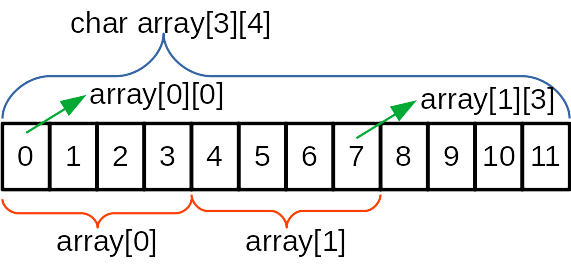
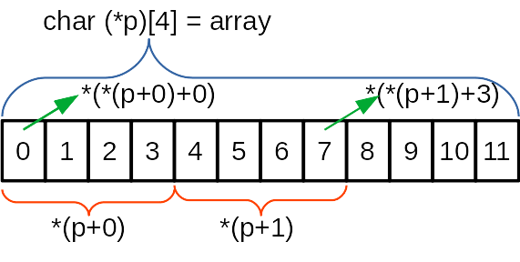
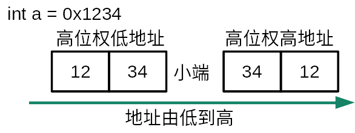

# 代码目录与项目简介

## 代码目录：/src

0. [99乘法表](src/99乘法表.c)
1. [动态数组](src/01动态数组.c)
2. [strlen](src/02strlen.c)
3. [多维数组与指针](src/03多维数组与指针.c)
4. [大端与小端](src/04大端与小端.c)
5. [sum_n](src/05sum_n.c)
6. [max_xy](src/06max_xy.c)
7. [va_sum](src/07va_sum.c)
8. [函数指针计算器](src/08函数指针计算器.c)
9. [递归阶乘](src/09递归阶乘.c)
10. [汉诺塔](src/10汉诺塔.c)
11. [快速排序](src/11快速排序.c)
12. [动态分配内存](src/12动态分配内存.c)
13. [单链表](src/13单链表.c)
14. `typedef`的用法
    - [单链表typedef](src/14.1单链表typedef.c)
    - [函数指针计算器typedef](src/14.2函数指针计算器typedef.c)
15. [单链表+内存池](src/15单链表+内存池.c)
16. 文件读写
    - [文件读写字符串](src/16.1文件读写字符串.c)
    - [格式化文件读写](src/16.2格式化文件读写.c)
17. [单链表+文件读写](src/17单链表+文件读写.c)

### 其他工具项目

- [CountLines](src/CountLines.c)
- [typesize](src/typesize.c)

## 项目简介

### 0. 99乘法表

使用嵌套循环打印一张99乘法表

- `%-3d`表示打印数字占用三个位置并左对齐，这样打印出来的表格更整洁。如果数字在不到三位，会在右边补充空格，但是如果数字超过三位，数字会显示完整。
- 命令行输出都是横向扫描打印，所以设计且套循环也要横向设计数据。代码中，i表示列，j表示行，j循环在内，按行打印。

### 1. 动态数组

程序运行时通过输入来动态设定字符数组的大小，然后输入字符串并输出字符数组的内容。

所谓动态数组，是指在程序运行时才为数组分配大小空间，分配之后就不能改变了。大部分教科书都认为数组必须在编译时就指定大小空间，这段代码运行成功了，证明这种写法也是合法的。但是更推荐使用malloc等函数来分配动态的存储空间。

- `scanf()`读取单个字符会在缓冲区遗留下一个回车符，影响后面的输入，所以在它之后要丢弃缓冲区内容。
- 字符串以`\0`结尾。

### 2. strlen

输入字符串，计算字符串的长度。

- 使用`getchar()`读取带空格的字符串的方法，通常以换行符`\n`或者`\r`作为字符串结束标志
- char字符数组会自动在字符串末尾添加`\0`

### 3. 多维数组与指针

数组指针是存放数组地址的指针，可以方便地存储多个字符串，也可以操作多维数组。这段代码通过实验验证了多维数组与数组指针的的对应关系，也验证了多维数组的存储结构。

- 数组是顺序存储结构，数组首地址始终是第一个元素的地址，也就是说`array/array[0]/array[0][0]`都指向同一个地址。
- 数组的每一个存储单元的大小是固定且相等的，`array[0]`和`array[1]`的大小相等，`array[0][0]`和`array[1][1]`的大小也相等。所以当没有指定数组大小时，数组会以成员中最大的一个存储块为单位分配存储空间，例如代码中会以较长的字符串为单位分配空间。

  
  

- 因为存储单元大小固定，对数组元素的访问可以通过计算地址实现。如图，`array[1][3]`的地址为`首地址 + 1 * 下一层存储块大小 + 3 * 下一层存储块大小（char类型的大小）`
- 当使用数组指针来访问多维数组时，其实就是通过计算地址来实现的。如图，`p`指向的是第一个含有四个元素的数组的首地址，`p+1`则指向第二个数组的首地址。`*p+1`就是`*(p+0)+1`指向第一个数组的第二个元素。

### 4. 大端与小端

两位十六进制数刚好可以占用一个字节空间，使用4位十六进制数就可以判断系统的大小端模式。
- 位权：就是数学中的数位，个十百千万，万为高位权，个是低位位权，二进制中同理。
- 内存地址通常从低到高按顺序分配。

  

- 大端与书写习惯一致，小端与位权顺序匹配。
- 所以如果将int类型的数字转化为char类型按字节读取，第一个字节存储的高位权数字，那么就是大端模式。

### 5. sum_n

这是一个简单的1,2,3,...,n的等差数列求和算法，实验子函数的运用。

### 6. max_xy

求x，y中更大的值，实验子函数多个参数的传递。

### 7. va_sum

实验参数数量可变的函数参数传递。传入多个数字参数，求它们的和。

- 函数声明时，可变参数使用`func(int n, ...)`，n表示参数的个数。
- 子函数中，声明`va_list vap`变量用于接收参数。
- 使用`va_start(vap,n)`开始接收参数，n为参数个数。
- 用`va_arg(vap,int)`返回一个参数，用循环读取每一个参数并计算。
- 最后别忘了用`va_end(vap)`释放可变参数数据。
- 使用函数时，别忘了第一个参数n，是后面可变参数的数量。

### 8. 函数指针计算器

函数指针是一个指向函数的指针，我们可以用它将函数像变量一样在函数之间直接传递，或者放入结构体、数组这样的数据结构中。

这里我们将函数指针作为参数和返回值在函数之间传递，实现简易的加减计算器。函数将自动检测输入的运算符从而调用不同的函数来实现计算。

- 代码中注意函数指针作为参数和返回值的不同写法，理解写法的意义。其实就是将函数声明中的函数名替换为`(*fp)`指针，参数照写就对了。但是写起来还是有些麻烦，后面会使用typedef来简化，使更容易理解。

### 9. 递归阶乘

求一个数的阶乘，可以用循环的方法，像之前的求1~n之和的方法一样。这里使用一种更简便的方法——递归。递归包含两个要素：

- 基线条件：
  - 函数避免调用自己的条件
- 递归条件：
  - 函数调用自己的条件

二者缺一不可，没有基线条件函数将陷入死循环，这也是使用递归的最大风险。没有递归条件就不能称之为递归函数了。

编写递归方法通常需要先写出一个递归方程，例如本例中就可以写出如下方程：

f(n) = n * f(n-1)

也就是说，第n个结果与第n-1个结果有关。

阶乘的数据是爆炸性的，20以上的阶乘即使用`unsigned long long`类型依然无法存下来，需要自定义数据类型去存储这种超大值，这里没有去设计这样的数据类型。

### 10. 汉诺塔

这是另一个递归实践。可以发现解决汉诺塔问题，使用递归可以极大简化程序的结构，让人更容易理解。

这个程序会自动规划多层汉诺塔的解法，并计算总共使用的步数。

这里的递归算法在注释中解释了，本质上也是n的结果可以由对n-1结果的操作来得出。
在递归应用中，对n的结果可能不只与n-1有关，还可能与n-2、n-3、n%2、n/2...有关，只要明确推导的方法、考虑到所有的基线条件，就能用递归完成任务。
